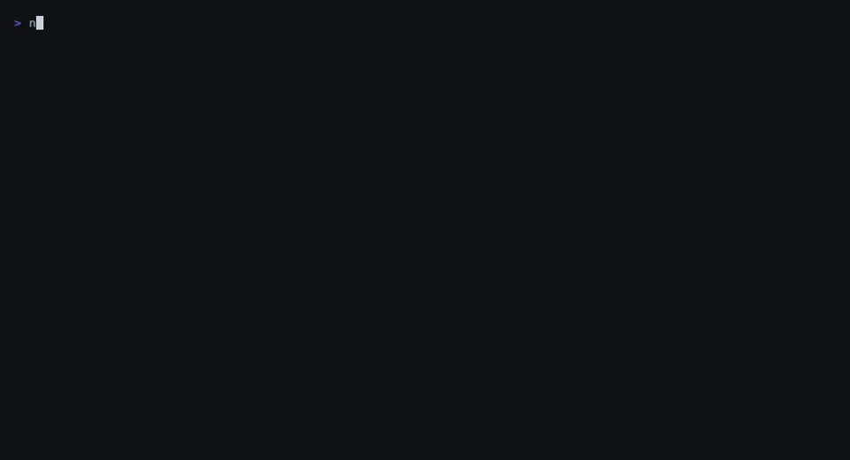

# pqaudit

[](https://github.com/PQCWorld/pqaudit/actions/workflows/ci.yml)
[](https://www.npmjs.com/package/pqaudit)
[](LICENSE)
[](https://nodejs.org)

Scan codebases for quantum-vulnerable cryptography. Get a clear picture of what needs to migrate before [Q-Day](https://en.wikipedia.org/wiki/Q-day).



pqaudit detects usage of RSA, ECDSA, Ed25519, ECDH, DH, and other algorithms broken by Shor's algorithm. It also identifies already-migrated PQC usage (ML-KEM, ML-DSA, SLH-DSA) so you can track migration progress. Output as human-readable text, JSON, [CycloneDX CBOM](https://cyclonedx.org/capabilities/cbom/), or [SARIF](https://sarifweb.azurewebsites.net/) for GitHub Code Scanning.

## Why now

On March 31, 2026, Google published research showing that breaking ECDSA-256 requires [20x fewer qubits than previously estimated](https://research.google/blog/safeguarding-cryptocurrency-by-disclosing-quantum-vulnerabilities-responsibly/) — roughly 1,200 logical qubits and under 500,000 physical qubits. NSA's CNSA 2.0 mandates PQC for new national security systems by 2027. The migration window is open but closing.

## Install

```bash
npx pqaudit ./my-project
```

Or install globally:

```bash
npm install -g pqaudit
pqaudit ./my-project
```

## Usage

```bash
# Scan current directory, human-readable output
pqaudit .

# Only show critical and high findings
pqaudit ./src --severity high

# Generate CycloneDX CBOM
pqaudit . --format cbom --output cbom.json

# Generate SARIF for GitHub Code Scanning
pqaudit . --format sarif --output results.sarif

# CI mode — exit code 1 if critical/high findings exist
pqaudit . --ci

# Show all findings including low-confidence comment matches
pqaudit . --min-confidence 0

# Show every occurrence instead of collapsing per file
pqaudit . --no-dedupe

# Skip dependency scanning
pqaudit . --no-deps

# Use custom rules
pqaudit . --rules ./my-rules.yaml
```

### All options

| Flag | Description | Default |
|------|-------------|---------|
| `-f, --format <format>` | Output format: `text`, `json`, `cbom`, `sarif`, `html` | `text` |
| `-o, --output <file>` | Write output to file | stdout |
| `-s, --severity <level>` | Minimum severity: `critical`, `high`, `medium`, `low`, `safe` | `safe` |
| `--min-confidence <0-100>` | Filter findings below this confidence threshold | `50` |
| `--no-dedupe` | Show all occurrences instead of collapsing per file | dedupe on |
| `--no-deps` | Skip dependency scanning | scan deps |
| `--include <patterns...>` | Glob patterns to include | all source files |
| `--exclude <patterns...>` | Additional glob patterns to exclude | node_modules, dist, etc. |
| `--rules <path>` | Path to custom rules YAML file | built-in rules |
| `--ci` | Exit code 1 if critical or high findings exist | off |

## Example output

```
  pqaudit — Post-Quantum Cryptography Readiness Scanner
  Scanned: ./my-project

  NOT PQC READY — Quantum-vulnerable cryptography detected

  Files scanned: 65  |  Findings: 12
  Critical: 7  High: 2  Medium: 1  Low: 0  Safe: 2

  --- CRITICAL (7) ---

  [!!] Ed25519 — Ed25519 signatures — vulnerable to Shor's algorithm (14 occurrences)
      src/crypto/signing.ts:14
      > import { sign, verify } from "@noble/ed25519";
      Fix: ML-DSA-65 (FIPS 204) or hybrid Ed25519+ML-DSA-65
      Confidence: 98% | Effort: moderate | Via: ast

  [!!] RSA — RSA signature — vulnerable to quantum factoring (3 occurrences)
      src/auth/jwt.ts:42
      > jwt.sign(payload, key, { algorithm: "RS256" });
      Fix: ML-DSA-65 (FIPS 204)
      Confidence: 96% | Effort: complex | Via: ast
  ...
```

## What it detects

### Critical (quantum-vulnerable — must migrate)

| Algorithm | Threat | Replacement |
|-----------|--------|-------------|
| RSA (any key size) | Shor's algorithm | ML-KEM-768 / ML-DSA-65 |
| ECDSA / Ed25519 | Shor's on elliptic curves | ML-DSA-65 (FIPS 204) |
| ECDH / X25519 / DH | Shor's on key exchange | ML-KEM-768 (FIPS 203) |
| DSA | Shor's algorithm | ML-DSA-65 (FIPS 204) |

### High (weakened by quantum or outdated protocols)

| Algorithm | Threat | Replacement |
|-----------|--------|-------------|
| AES-128 | Grover reduces to 64-bit | AES-256 |
| TLS 1.0/1.1, SSLv3 | Deprecated protocols | TLS 1.3 |
| Kubernetes TLS secrets | May use vulnerable certs | Rotate to PQC when available |
| Dockerfile crypto installs | Review for vulnerable algorithms | PQC-capable libraries |

### Safe (already quantum-resistant)

ML-KEM (Kyber), ML-DSA (Dilithium), SLH-DSA (SPHINCS+), AES-256, ChaCha20-Poly1305, SHA-256, SHA-3

### Protocol and config detection

pqaudit also scans configuration files for quantum-vulnerable settings:

- **SSH**: RSA/ECDSA key types, DH/ECDH key exchange in `sshd_config`/`ssh_config`
- **TLS**: deprecated protocols and vulnerable cipher suites in nginx/apache/haproxy configs
- **Kubernetes**: TLS secrets and cert-manager RSA private keys
- **Docker**: crypto library installs in Dockerfiles

## Output formats

### CycloneDX CBOM

Generates a [Cryptographic Bill of Materials](https://cyclonedx.org/capabilities/cbom/) conforming to CycloneDX 1.6. Each cryptographic finding becomes a `crypto-asset` component with `cryptoProperties`, NIST quantum security levels, and evidence locations.

```bash
pqaudit . --format cbom --output cbom.json
```

### SARIF (GitHub Code Scanning)

Generates SARIF 2.1.0 output compatible with GitHub's code scanning. Upload via `github/codeql-action/upload-sarif`.

```bash
pqaudit . --format sarif --output results.sarif
```

### HTML report

Self-contained HTML file with a visual dashboard — severity breakdown, PQC readiness score, and findings table. No external dependencies, works offline.

```bash
pqaudit . --format html --output report.html
```

## GitHub Action

```yaml
name: PQC Audit
on: [push, pull_request]
jobs:
  pqaudit:
    runs-on: ubuntu-latest
    steps:
      - uses: actions/checkout@v4
      - uses: actions/setup-node@v4
        with:
          node-version: "20"
      - run: npx pqaudit . --format sarif --output pqaudit.sarif --ci
      - uses: github/codeql-action/upload-sarif@v3
        if: always()
        with:
          sarif_file: pqaudit.sarif
          category: pqaudit
```

## Dependency scanning

pqaudit checks manifest files for known cryptographic libraries across five ecosystems:

| Ecosystem | Manifest files | Example packages |
|-----------|---------------|-----------------|
| **npm** | `package.json` | `@noble/ed25519`, `node-rsa`, `jsonwebtoken`, `ethers` |
| **Rust** | `Cargo.toml` | `ed25519-dalek`, `rsa`, `ring`, `p256`, `pqcrypto` |
| **Go** | `go.mod` | `golang.org/x/crypto`, `cloudflare/circl` |
| **Python** | `requirements.txt`, `pyproject.toml` | `cryptography`, `pycryptodome`, `paramiko` |
| **Java** | `build.gradle`, `pom.xml` | BouncyCastle, Google Tink |

PQC-safe libraries (`@noble/post-quantum`, `pqcrypto`, `cloudflare/circl`, `bcpqc`) are flagged as **safe** for inventory tracking.

## Custom rules

Rules are defined in YAML:

```yaml
- id: MY_CUSTOM_RULE
  description: "Custom quantum-vulnerable pattern"
  severity: critical
  category: signature
  algorithm: MyAlgo
  replacement: ML-DSA-65
  effort: complex
  languages: ["javascript", "typescript"]
  patterns:
    - "myVulnerableFunction\\("
    - "import.*myVulnerableLib"
```

See [CONTRIBUTING.md](CONTRIBUTING.md) for the full rule schema and how to submit new rules.

## Detection methods

pqaudit uses two detection layers that run together:

- **L0 (regex)**: Pattern matching across all supported languages and config files. Works on any file type. Confidence varies by context (0.3 in comments, 0.7-0.9 in code).
- **L1 (AST)**: Tree-sitter parsing for JavaScript/TypeScript. Detects actual imports, function calls, and API usage — not just text matches. Eliminates false positives from comments and documentation. Confidence 0.95-0.98.

When both scanners find the same crypto usage, deduplication keeps the higher-confidence finding.

Planned:

- **L2**: Data flow / taint analysis for tracing cryptographic data through call chains
- **Network scanning**: TLS/SSH endpoint analysis

## Contributing

See [CONTRIBUTING.md](CONTRIBUTING.md) for guidelines on submitting rules, bug fixes, and new features.

## References

- [NIST FIPS 203 — ML-KEM](https://csrc.nist.gov/pubs/fips/203/final)
- [NIST FIPS 204 — ML-DSA](https://csrc.nist.gov/pubs/fips/204/final)
- [NIST FIPS 205 — SLH-DSA](https://csrc.nist.gov/pubs/fips/205/final)
- [NSA CNSA 2.0 Timeline](https://media.defense.gov/2022/Sep/07/2003071836/-1/-1/0/CSI_CNSA_2.0_FAQ_.PDF)
- [CycloneDX CBOM Specification](https://cyclonedx.org/capabilities/cbom/)
- [Google PQC Migration Timeline (March 2026)](https://blog.google/innovation-and-ai/technology/safety-security/cryptography-migration-timeline/)
- [Google Quantum Vulnerability Research (March 2026)](https://research.google/blog/safeguarding-cryptocurrency-by-disclosing-quantum-vulnerabilities-responsibly/)

## License

MIT
